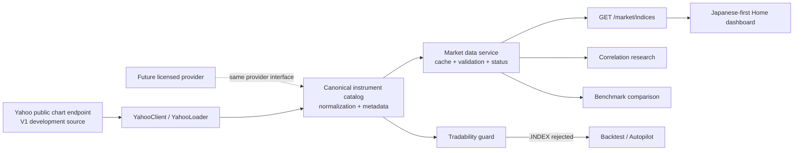

# 日本市场三大指数能力改造实施计划

> 状态：`DRAFT — 待审核，未授权实施`
>
> 目标版本：V1（日本市场优先的研究型指数看板）
>
> 覆盖指数：日经 225、纳斯达克综合指数、道琼斯工业平均指数
>
> 最后更新：2026-07-17

## 1. 执行摘要

本计划把 Vibe-Trading 从“已具备多市场研究与回测基础，但没有统一指数模型”的状态，改造成面向日本用户的三大指数研究入口。V1 的核心不是增加三个临时 ticker，而是先建立一层稳定的指数标识、数据源映射和时区/币种语义，再把能力接入行情读取、相关性、基准比较、REST API 和日语首页。

建议 V1 锁定以下产品边界：

- 首页第一屏展示日经 225、纳斯达克综合指数、道琼斯工业平均指数的最新可用日线数据、涨跌幅和历史走势。
- 日经 225 是主视觉和默认选中项；美国两大指数用于日本投资者隔夜市场参考。
- 支持三大指数的行情读取、研究对话、相关性分析和回测基准比较。
- 指数是研究/基准资产，不作为可下单、可撮合或可直接回测交易的证券。
- V1 使用 Yahoo 公共 Chart Endpoint 作为开发及内部验证数据源；不把它描述为官方、实时或具有商业 SLA 的数据服务。
- 商业公开上线前设置数据授权门槛：必须确认展示权、再分发权、指数商标/名称使用要求和延迟标识，必要时切换到持牌供应商。
- 日语成为日本发行版的默认回退语言，同时保留用户已保存的语言选择及浏览器语言识别。

## 2. 审核时需要先确认的决策

下列决策会直接改变工期或产品形态。建议审核时逐项标记“同意 / 修改 / 暂缓”。

| 编号 | 待确认决策 | 本计划建议 | 影响 |
|---|---|---|---|
| D1 | V1 数据用途 | 开发、内部验证和小范围测试；正式商业发布另设数据授权 Gate | 避免把免费抓取能力误当成可长期商用的数据合同 |
| D2 | V1 数据频率 | 仅日线；页面缓存 60 秒，但不宣称实时 | 日线足够完成趋势、相关性和基准研究，显著降低时区及限流复杂度 |
| D3 | 产品入口 | 改造现有 `/` 首页第一屏，不新增独立行情路由 | 最短路径体现“日本市场优先”，并保留现有研究入口 |
| D4 | 默认语言 | 日本发行版回退语言改为日语；显式用户选择优先 | 日本用户首次访问更自然，不破坏已保存语言偏好 |
| D5 | 指数交易语义 | 禁止把 `.INDEX` 作为可交易 backtest code；只允许研究、相关性和 benchmark | 避免产生不可执行或误导性的交易结果 |
| D6 | 日经可交易代理 | V1 不静默指定 ETF；用户发起交易/回测时要求显式选择代理产品 | 不同市场、币种、费用和跟踪误差不能由系统替用户决定 |
| D7 | V1 供应商 | Yahoo 公共接口，后端统一适配；预留商用 provider 插槽 | 无 API Key、实施快，但商业稳定性和授权不成立 |

若 D1 决定为“立即公开商业上线”，则必须先执行第 11 节的商用数据采购支线，不能按当前 V1 数据路径直接发布。

## 3. 范围定义

### 3.1 V1 范围内

- 三个规范化指数标识及别名解析。
- Yahoo provider symbol 映射和日线 OHLCV 读取。
- `global_index` 市场类型及 loader fallback chain。
- 统一的币种、交易所时区、区域、显示名和数据状态元数据。
- 新增只读行情 REST API。
- 日本市场优先的首页指数概览、指数切换和历史走势图。
- 日语行情文案、指标标签、日期、数字和货币格式。
- 相关性分析支持三大指数。
- benchmark 显式接受三大指数。
- 对指数直接交易/回测的明确拒绝及可操作提示。
- 单元测试、API 集成测试、前端组件测试和构建验证。
- 数据来源及延迟免责声明。

### 3.2 V1 明确不做

- 实时 tick、分钟线、盘前盘后行情或 WebSocket 推送。
- 日本个股全市场、成分股列表、指数权重、公司基本面或公司行动。
- 交易所交易日历的完整服务化；V1 仅消费 provider 返回的有效日线。
- 券商接入、下单、模拟撮合或指数衍生品交易。
- 自动选择日经 ETF、指数期货或 CFD 作为交易代理。
- 新闻、情绪、宏观事件时间轴和日文 AI 摘要。
- 用户自定义任意指数列表。
- 对 Yahoo 公共接口作可用性、时效性或商业授权承诺。

## 4. 当前状态与确认过的缺口

当前项目已经具备 FastAPI、React、ECharts、多语言、loader registry、相关性和 benchmark 基础，因此本次不是重建架构。主要问题是指数语义散落且不一致。

| 位置 | 当前行为 | 风险/缺口 |
|---|---|---|
| `agent/src/market_data.py:21-39` | 仅识别 `.US`、`.HK`、`.NS`、`.BO` 等；未知代码默认 Tushare | `^N225`、`^IXIC`、`^DJI` 会路由错误 |
| `agent/backtest/loaders/yahoo_loader.py:41-43` | Yahoo loader 只接受股票后缀 | Yahoo 原生指数代码会被拒绝 |
| `agent/backtest/loaders/yahoo_loader.py:156-162` | Yahoo 声明的 markets 不含指数 | registry 无法按指数市场选择 loader |
| `agent/backtest/loaders/registry.py:130-140` | fallback chain 不含 `global_index` | 没有指数数据降级策略 |
| `agent/backtest/engines/_market_hooks.py:25-81` | 没有指数规则；未知代码默认 A 股 | 指数可能进入错误 engine 或交易规则 |
| `agent/backtest/correlation.py` | 维护了另一套 symbol 归一化和市场识别 | 即使主路由修复，相关性仍可能把指数当美股 |
| `agent/backtest/benchmark.py` | benchmark 市场表和 ticker 推断不支持统一指数目录 | 三大指数不能稳定作为显式基准 |
| `agent/src/tools/autopilot_tool.py:183-205` | Nasdaq/Dow 静默映射到 QQQ/DIA；Nikkei 映射为错误的 `^N225.HK` | 混淆“指数研究标的”和“可交易代理” |
| `frontend/src/i18n/index.ts:51-55` | 首次访问默认回退英语 | 不符合日本市场优先定位 |
| `frontend/src/lib/formatters.ts:3-46` | 指标标签只有英文和中文 | 日语界面仍显示英文指标 |
| `frontend/src/pages/Home.tsx` | 首页以通用研究产品介绍为主 | 第一屏没有日本市场信息 |
| `frontend/src/lib/api.ts` | 只有相关性等现有接口，无指数行情 contract | 前端没有稳定的行情读取入口 |

此外，部分组件仍存在硬编码美元符号，日期格式有依赖浏览器默认 locale 的情况。它们不应通过全局替换处理，而应改为显式传递 `currency`、`locale` 和 `timeZone`。

## 5. 目标架构



架构原则：

1. 内部只使用 canonical symbol，provider symbol 只存在于 provider adapter 边界。
2. instrument metadata 是唯一事实来源；禁止在 API、相关性、autopilot 和前端分别维护 ticker 表。
3. 行情返回值必须携带币种、时区、来源和延迟状态，前端不能猜。
4. “能获取价格”与“可交易”是两个不同能力；指数默认 `tradable=false`。
5. 数据供应商可替换，REST API 和前端 contract 不随 provider 变化。

## 6. 数据模型与标识规范

### 6.1 Canonical symbol

| Canonical symbol | 日文名 | 英文名 | 区域 | 币种 | 市场时区 | Yahoo symbol |
|---|---|---|---|---|---|---|
| `NIKKEI225.INDEX` | 日経平均株価 | Nikkei 225 | JP | JPY | Asia/Tokyo | `^N225` |
| `NASDAQCOMPOSITE.INDEX` | ナスダック総合指数 | Nasdaq Composite | US | USD | America/New_York | `^IXIC` |
| `DJIA.INDEX` | ダウ・ジョーンズ工業株価平均 | Dow Jones Industrial Average | US | USD | America/New_York | `^DJI` |

注意：这里的 `.INDEX` 是项目内部命名，不代表交易所官方代码。

### 6.2 接受的输入别名

所有外部输入在进入 loader、相关性或 benchmark 前统一归一化：

```text
^N225, N225, nikkei, nikkei 225, 日経平均, 日经225
  -> NIKKEI225.INDEX

^IXIC, IXIC, nasdaq composite, ナスダック総合
  -> NASDAQCOMPOSITE.INDEX

^DJI, DJI, djia, dow jones, ダウ平均
  -> DJIA.INDEX
```

单独的 `nasdaq` 存在语义歧义：可能指交易所、综合指数、Nasdaq-100 或 QQQ。V1 在研究型入口中解析为 Nasdaq Composite；在交易/回测入口中不得静默映射，必须提示用户选择可交易证券。

### 6.3 Instrument 定义

新增 `agent/backtest/instruments.py`，提供不可变目录和纯函数接口：

```python
@dataclass(frozen=True)
class Instrument:
    canonical_symbol: str
    display_name: str
    display_name_ja: str
    asset_type: Literal["index"]
    market: Literal["global_index"]
    region: Literal["JP", "US"]
    currency: Literal["JPY", "USD"]
    timezone: str
    tradable: bool
    provider_symbols: Mapping[str, str]

def normalize_symbol(value: str) -> str: ...
def get_instrument(value: str) -> Instrument | None: ...
def provider_symbol(value: str, provider: str) -> str: ...
def detect_market(value: str) -> str | None: ...
```

`normalize_symbol` 必须幂等；未知标的保持原值，不修改当前未知代码的兼容行为。目录初期只放三大指数，避免借本次改造顺带迁移所有证券类型。

## 7. 数据源方案

### 7.1 V1 选择

V1 使用现有 Yahoo direct HTTP loader，原因是无 API Key、已经接入项目、可快速完成三大指数的日线验证。该选择只解决“技术可取数”，不等于“商业可合法长期分发”。

需要增加：

- canonical symbol 到 Yahoo symbol 的映射。
- Yahoo loader 对 `global_index` 的声明与支持。
- loader 输出前恢复 canonical key，禁止把 `^N225` 泄漏为内部主键。
- 60 秒进程内 TTL cache；同一 range 的并发请求合并，避免重复打公共 endpoint。
- 单次固定最多三个指数、最多返回 260 根日线。
- 网络失败、空数据、限流和 provider schema 变化使用可区分的错误码。

### 7.2 免费/低成本数据源定位

| 数据源 | V1 定位 | 优点 | 限制/风险 |
|---|---|---|---|
| Yahoo public chart endpoint | 开发和内部验证默认源 | 免费、无 Key、三个指数都可取 | 非正式商业 API；无 SLA；字段和限流可变化；授权边界不清晰 |
| Stooq | 灾备调研候选，不进入 V1 fallback | 免费历史数据、适合离线研究 | 指数覆盖和 symbol 需逐项验证；不保证实时/商用再分发 |
| J-Quants API | 日本股票扩展候选 | JPX 官方服务，适合后续日本个股/财务数据 | 个人版与法人/商业用途边界不同；本次三指数场景不是完整替代 |
| Twelve Data | 商用 provider 候选 | 统一 API、覆盖全球指数 | 免费层有限；指数权限、延迟和再分发需看套餐合同 |
| Nasdaq GIDS | Nasdaq 指数权威商用路径 | 官方指数数据分发 | 需许可和费用 |
| S&P Dow Jones Indices | DJIA 权威商用路径 | 官方授权与数据许可 | 需许可和费用 |
| Nikkei Indexes | 日经指数权威商用路径 | 官方指数许可 | 网站/应用展示及名称使用可能需要许可 |

正式采购或法务核对入口：

- Nikkei Index Licensing: <https://indexes.nikkei.co.jp/nkave/license/index.en.html>
- Nasdaq Global Index Data Service: <https://www.nasdaq.com/solutions/global-indexes/data/gids>
- S&P DJI Data & Index Licensing: <https://www.spglobal.com/spdji/en/about-us/data-index-licensing/>
- JPX J-Quants API: <https://www.jpx.co.jp/english/markets/other-data-services/j-quants-api/index.html>
- JPX J-Quants Pro: <https://www.jpx.co.jp/english/markets/other-data-services/j-quants-pro/index.html>
- Twelve Data Indices: <https://twelvedata.com/indices>

### 7.3 商业上线数据 Gate

公开商业上线前必须有一份书面记录确认：

- 三个指数的数值展示、历史图表和缓存是否属于允许用途。
- 数据是否允许面向终端用户再分发。
- 必须展示的 attribution、延迟分钟数、免责声明和商标文本。
- 每用户、每设备或每月调用量计费方式。
- 是否允许将原始数据交给 AI 模型、保存为研究 artifact 或用于回测。
- 数据终止后历史缓存的保留和删除义务。

未通过 Gate 时，生产构建通过 feature flag 隐藏指数看板，只保留内部环境。

## 8. 后端实施设计

### 8.1 Phase A：统一指数目录和路由

涉及文件：

- 新增 `agent/backtest/instruments.py`
- 修改 `agent/src/market_data.py`
- 修改 `agent/backtest/loaders/yahoo_loader.py`
- 修改 `agent/backtest/loaders/registry.py`
- 修改 `agent/backtest/engines/_market_hooks.py`
- 修改 `agent/backtest/correlation.py`

具体工作：

1. 建立三大指数目录、别名和 provider 映射。
2. `detect_source()` 在归一化后将 `.INDEX` 路由到 Yahoo。
3. Yahoo loader 接受 canonical index，发请求前转换为 `^N225/^IXIC/^DJI`，返回时仍以 canonical symbol 为 key。
4. Yahoo loader 增加 `global_index` market。
5. registry 增加：

   ```python
   "global_index": ["yahoo", "local"]
   ```

   V1 不把未经逐项验证的 provider 塞进 fallback chain。
6. `_detect_market()` 识别 `.INDEX -> global_index`，但保留未知代码默认行为以降低回归风险。
7. `correlation.py` 删除自己的指数相关归一化分支，复用统一目录。股票原有逻辑暂不大规模重构。

### 8.2 Phase B：指数服务与 REST API

涉及文件：

- 新增 `agent/src/api/market_routes.py`
- 修改 `agent/api_server.py`
- 新增 `agent/tests/test_market_routes.py`

新增接口：

```http
GET /market/indices?range=1m
```

V1 不接受任意 `symbols`，固定返回三大指数，减少滥用、限流和输入攻击面。`range` allowlist：`1m | 3m | 6m | 1y`，默认 `1m`；统一使用 `1D` 数据。

响应 contract：

```json
{
  "as_of": "2026-07-17T08:00:00Z",
  "range": "1m",
  "interval": "1D",
  "items": [
    {
      "symbol": "NIKKEI225.INDEX",
      "name": "Nikkei 225",
      "name_ja": "日経平均株価",
      "market": "global_index",
      "region": "JP",
      "currency": "JPY",
      "timezone": "Asia/Tokyo",
      "source": "yahoo",
      "delay_status": "unknown",
      "tradable": false,
      "latest": {
        "timestamp": "2026-07-17T00:00:00+09:00",
        "open": 0.0,
        "high": 0.0,
        "low": 0.0,
        "close": 0.0,
        "volume": 0.0
      },
      "previous_close": 0.0,
      "change": 0.0,
      "change_percent": 0.0,
      "series": [
        {
          "timestamp": "2026-07-17T00:00:00+09:00",
          "open": 0.0,
          "high": 0.0,
          "low": 0.0,
          "close": 0.0,
          "volume": 0.0
        }
      ]
    }
  ],
  "errors": []
}
```

约束和错误语义：

- `delay_status` 枚举：`unknown | eod | delayed | realtime`。Yahoo V1 固定 `unknown`，不得推断为实时。
- 单个指数失败不导致整体 500；成功项进入 `items`，失败项进入 `errors`。
- 全部失败时返回 `503`，body 保留每个 symbol 的机器可读原因。
- 非 allowlist range 返回 `422`。
- 使用现有 `require_local_or_auth` 安全边界；远程访问必须认证。
- 每 IP 每分钟最多 60 次；cache hit 仍可返回，但记录请求计数。
- 日志只记录 canonical symbol、provider、耗时、cache hit 和错误类别，不记录 API Key 或认证头。

建议错误项：

```json
{
  "symbol": "NIKKEI225.INDEX",
  "code": "PROVIDER_UNAVAILABLE",
  "message": "Market data is temporarily unavailable."
}
```

### 8.3 Phase C：研究、相关性和 benchmark

涉及文件：

- 修改 `agent/backtest/correlation.py`
- 修改 `agent/backtest/benchmark.py`
- 修改 `agent/src/agent/context.py`
- 修改 `agent/src/tools/autopilot_tool.py`

规则：

- 相关性允许输入三大指数 canonical symbol 或别名。
- 日线相关性以各交易所的 `session date` 对齐并 inner join；UI/结果中明确标注它不是按同一瞬间对齐，也不代表领先/滞后关系。
- benchmark 的 `explicit` 参数允许 canonical index；取数仍经共享 loader，不再直接假设 yfinance ticker。
- 研究对话可把“日经/纳指/道指”解析为 canonical index。
- autopilot 将“研究 universe”和“可交易 universe”拆开：
  - 研究请求返回 canonical index。
  - 交易/回测请求遇到 index 时返回 `INDEX_NOT_TRADABLE`。
  - QQQ、DIA 等代理只有用户明确选择后才能使用。
  - 删除错误的 `^N225.HK` 映射。

直接回测拒绝示例：

```json
{
  "code": "INDEX_NOT_TRADABLE",
  "symbol": "NIKKEI225.INDEX",
  "message": "指数仅用于研究和基准比较。请选择明确的 ETF、期货或其他可交易代理。"
}
```

## 9. 前端与日文化实施设计

### 9.1 首页信息架构

修改现有 `frontend/src/pages/Home.tsx`，不新增路由。首屏顺序：

1. 页面标题：日本用户视角的全球市场概览。
2. 三张指数卡：日经 225 在第一位并默认选中，其次 Nasdaq Composite、DJIA。
3. 选中指数的日线趋势图，range 支持 1M / 3M / 6M / 1Y。
4. 数据来源、最后更新时间、市场时区和“可能延迟”的明确提示。
5. 保留现有“开始研究”等 CTA 和通用产品说明，移到行情模块之后。

新增组件：

- `frontend/src/components/market/IndexOverview.tsx`
- `frontend/src/components/market/IndexCard.tsx`
- `frontend/src/components/market/IndexChart.tsx`
- `frontend/src/components/market/MarketDataNotice.tsx`

图表复用现有 `frontend/src/lib/echarts.ts` 中的 ECharts，不引入新图表依赖。V1 采用 close line chart，不在首页堆叠 K 线、成交量和技术指标。

交互状态：

- Loading：保留卡片骨架，避免布局跳动。
- Partial success：成功指数正常显示，失败卡片显示可重试状态。
- Empty：显示“この期間のデータはありません”。
- Network failure：显示可重试按钮，不用零值伪装行情。
- Stale/unknown：持续显示数据延迟提示。
- 正负颜色不能作为唯一信息，必须同时显示 `+/-` 符号和文本/aria-label。

### 9.2 API 类型

修改 `frontend/src/lib/api.ts`：

- 新增 `MarketIndexItem`、`MarketIndexBar`、`MarketIndexError`、`MarketIndicesResponse`。
- 新增 `api.getMarketIndices(range, signal)`。
- `range` 使用 TypeScript union，禁止拼接任意字符串。
- 页面 unmount 或 range 切换时通过 `AbortSignal` 取消旧请求。

### 9.3 日语与格式化

涉及文件：

- 修改 `frontend/src/i18n/index.ts`
- 修改五份 locale JSON，至少保证新 key 在所有语言中存在
- 修改 `frontend/src/lib/formatters.ts`
- 检查 `Runtime.tsx`、`RunnerStatus.tsx`、`MandateProposalCard.tsx`、`Reports.tsx` 的硬编码格式

实施规则：

- `fallbackLng` 改为可配置的 `VITE_DEFAULT_LANGUAGE`，默认值为 `ja`。
- 语言检测优先级保持：用户已保存选择 > 浏览器语言 > 日本发行版默认值。
- 指标标签迁移到 locale JSON，而不是继续增加第三张硬编码映射表。
- 新增：

  ```ts
  formatCurrency(value, currency, locale)
  formatMarketNumber(value, locale)
  formatMarketDateTime(value, locale, timeZone)
  ```

- JPY 默认 0 位小数，USD 按场景最多 2 位；指数点位使用 locale 千分位但不添加货币符号。
- 市场更新时间明确使用 instrument timezone；必要时同时显示日本时间，不依赖操作系统默认时区。
- 首屏日语文案必须由母语级审核确认，尤其是指数正式名称、数据延迟和投资免责声明。

日语免责声明草案（上线前需法务/母语审核）：

> 本データは情報提供のみを目的としており、投資助言ではありません。データは遅延する場合があり、正確性・完全性を保証するものではありません。

## 10. 测试与验收计划

### 10.1 单元测试

新增或修改：

- `agent/tests/test_instruments.py`
- `agent/tests/test_market_data.py`
- `agent/tests/test_yahoo_loader.py`
- `agent/tests/test_registry.py`
- `agent/tests/test_market_detection.py`
- `agent/tests/test_correlation.py`
- `agent/tests/test_autopilot_tool.py`
- 新增 `agent/tests/test_benchmark.py`
- `frontend/src/i18n/__tests__/i18n.test.ts`
- `frontend/src/lib/__tests__/formatters.test.ts`
- 新增 `frontend/src/components/market/__tests__/IndexOverview.test.tsx`

最低测试矩阵：

| 类别 | 必测项 |
|---|---|
| 归一化 | 每个 canonical symbol、Yahoo symbol、英文/日文/中文别名；大小写和前后空格；幂等；未知 symbol 不变 |
| Provider mapping | 三个 canonical -> Yahoo symbol；未知 provider/symbol 明确失败 |
| Loader | 日经/纳指/道指请求参数、key 还原、空数据、缺 volume、网络失败、日线时间戳 |
| Registry | `global_index` chain 顺序、Yahoo 不可用时 local fallback、其他 market chain 不回归 |
| Market detection | `.INDEX` 正确识别；原有 A/HK/US/India/crypto/futures/forex 规则保持 |
| API | 四种 range、非法 range、三项成功、部分成功、全部失败、cache、认证/远程边界 |
| Correlation | 三指数 session-date 对齐、缺失日 inner join、数据不足错误 |
| Benchmark | 显式 canonical index、provider 失败、返回序列与 total return |
| Tradability | index 研究允许、直接回测拒绝、无静默 ETF 代理 |
| i18n | 默认日语、保存语言优先、浏览器语言、fallback key 完整 |
| Formatters | ja-JP/JST、en-US/ET、JPY/USD、正负值、DST 边界 |
| UI | loading/success/partial/empty/error、range 切换、键盘操作、aria label |

### 10.2 集成测试

- 使用 mocked Yahoo payload 跑 `market_routes`，不让 CI 依赖公网。
- 从 alias 输入贯穿到 canonical API 输出，验证 provider symbol 不泄漏。
- 三指数相关性端到端使用固定 fixture，结果可复现。
- benchmark 以固定日线 fixture 计算回报，验证日期对齐。
- Home mock API 响应，验证日语首屏及 partial failure。

### 10.3 可选网络 smoke test

网络 smoke test 单独标记，不进入阻塞 CI：

- 三个 Yahoo symbol 各拉最近 10 个交易日。
- 校验至少 2 根有效 bar、close > 0、日期递增、最后日期不过度陈旧。
- 失败只报告 provider 状态，不把公网波动归类为代码单测失败。

### 10.4 验证命令

实施阶段至少运行：

```bash
cd agent
pytest tests/test_instruments.py tests/test_market_data.py tests/test_yahoo_loader.py tests/test_registry.py tests/test_market_detection.py tests/test_correlation.py tests/test_benchmark.py tests/test_autopilot_tool.py tests/test_market_routes.py -q

cd ../frontend
npm test -- --run
npm run build
```

最后再运行项目现有完整 Python 测试集；若耗时或依赖导致无法全量执行，必须记录未执行项和原因，不能只报告新增测试通过。

### 10.5 验收标准

所有条目必须同时满足：

- [ ] 三个 canonical symbol 都能从统一入口取到历史日线。
- [ ] API 输出只有 canonical symbol，不暴露 provider ticker 作为业务主键。
- [ ] 首页第一屏默认日语且日经 225 位于首位、默认选中。
- [ ] 页面显示来源、更新时间、时区和延迟/未知状态。
- [ ] 任一指数取数失败不会让其余两个消失。
- [ ] 价格和时间在 `ja-JP` 下格式正确，日经不显示 `$`。
- [ ] 三大指数可用于相关性和显式 benchmark。
- [ ] 三大指数不能被直接作为可交易回测标的。
- [ ] `nasdaq` 在研究与交易语境下不会静默混淆 Composite、Nasdaq-100 和 QQQ。
- [ ] 现有 A 股、美股、港股、印度股票、crypto、futures、forex 路由测试无回归。
- [ ] 前端测试和生产构建通过。
- [ ] 商业发布前数据授权 Gate 已通过；否则功能只在内部环境开启。

## 11. 商用数据采购支线

此支线不阻塞内部 V1，但阻塞公开商业发布。

1. 形成真实使用场景说明：用户规模、地区、刷新频率、历史长度、是否缓存、是否导出、是否交给 AI。
2. 分别向 Nikkei、Nasdaq、S&P DJI 或其授权 vendor 询价。
3. 对比“分别采购”与“统一聚合商”两种成本和合同复杂度。
4. 要求供应商确认三个具体指数，而不是只确认泛称“global indices”。
5. 法务确认指数名称、logo、数值和 derived analytics 的使用边界。
6. 技术侧通过同一 provider interface 新增 adapter，不修改前端 contract。
7. 在 staging 做至少 10 个交易日的双源对账：close、日期、币种、corporate calendar、延迟状态。
8. 达标后切换 production feature flag；Yahoo 仅保留开发 fallback 或完全移除。

建议双源对账阈值：同一 session 的 close 差异绝对值小于供应商约定精度；缺失 session 和时区错位必须为 0。任何差异都先判断交易日/时区语义，不自动“平均”两个来源。

## 12. 发布、监控与回滚

### 12.1 Feature flags

建议新增：

```text
VIBE_MARKET_INDICES_ENABLED=false
VIBE_MARKET_DATA_PROVIDER=yahoo
VITE_DEFAULT_LANGUAGE=ja
```

- 默认关闭 production 指数看板，staging/internal 开启。
- provider 配置必须是 allowlist，不能由请求参数指定任意 URL 或模块。
- 前端关闭时回到当前 Home 页面，不出现空白区域。

### 12.2 分阶段发布

1. **开发环境**：mock + Yahoo 网络 smoke，完成 contract。
2. **内部 staging**：连续观察至少 5 个日美交易日，检查时区、节假日和数据新鲜度。
3. **小范围 beta**：开启日本用户语言/格式验证，收集指数命名和信息层级反馈。
4. **商业生产**：只有数据授权 Gate 通过后才能开启。

### 12.3 监控指标

- `market_data_requests_total{provider,symbol,status}`
- `market_data_request_duration_ms{provider}`
- `market_data_cache_hit_total`
- `market_data_last_success_age_seconds{symbol}`
- `market_data_partial_response_total`
- `market_data_schema_error_total{provider}`

告警建议：

- 单个指数连续 3 次失败：warning。
- 全部指数连续 2 次失败：critical，并自动隐藏数值、显示数据不可用。
- 日本/美国各自交易日收盘后超过约定窗口仍无新 bar：stale warning。
- provider schema error：立即告警，不把解析失败显示为 0。

### 12.4 回滚

- 首选回滚：关闭 `VIBE_MARKET_INDICES_ENABLED`，恢复当前 Home，不回滚数据库（V1 不新增持久化 schema）。
- provider 故障：切换到经过验证且已有授权的 adapter；禁止临时抓取未知网站顶替。
- 代码回滚：本次新增目录/API 均为增量，原有 market 路由兼容行为由测试保护。
- 缓存内容只在内存中，进程重启即可清除；无需数据迁移或破坏性命令。

## 13. 安全、合规和产品表达

- REST API 继续使用项目现有本地/认证策略，不能因为行情是“免费数据”就开放无界限代理。
- 禁止接收用户提供的 provider URL，避免 SSRF。
- range 和 symbol 均使用 allowlist，限制 payload 和上游调用成本。
- provider 错误不能把原始响应、cookie、认证信息或完整 URL query 写入前端和日志。
- 页面不得使用“实时”“官方”“准确无误”等未被合同支持的表述。
- 明确“信息提供，不构成投资建议”。
- 若未来记录用户自选指数，不在本次引入用户画像或跨设备跟踪。
- 指数名称和品牌用法须按权利方要求展示 attribution。

## 14. 实施拆分、依赖和预计工作量

这是一项跨后端、前端、数据合规的 Epic，建议拆成以下可独立验收的子任务：

| 子任务 | 内容 | 依赖 | 预计 |
|---|---|---|---|
| T1 | Instrument catalog、alias、provider mapping、market detection | 无 | 1.0–1.5 天 |
| T2 | Yahoo global index loader、registry、cache 与错误语义 | T1 | 1.0–1.5 天 |
| T3 | `/market/indices` API、类型、限流、partial response | T1、T2 | 1.0–1.5 天 |
| T4 | Correlation、benchmark、autopilot tradability guard | T1、T2 | 1.0–1.5 天 |
| T5 | 首页指数概览与 ECharts 趋势图 | T3 | 1.5–2.0 天 |
| T6 | 日语默认、locale keys、币种/时区 formatter | T3，可与 T5 部分并行 | 1.0–1.5 天 |
| T7 | 全量测试、staging smoke、文档和发布开关 | T1–T6 | 1.0–1.5 天 |
| T8 | 商业授权与 provider 采购 | 可并行，阻塞商业生产 | 外部周期 1–6+ 周 |

工程实施合计约 **7.5–11 个工程日**，不含外部数据合同谈判、视觉稿往返和日语法务审核。单人串行建议预留 2–3 个自然周；若前后端并行，需要先冻结本计划中的 API contract 和 instrument catalog。

依赖顺序：

```text
T1 -> T2 -> T3 -> T5 -> T7
 |     |     |     -> T6 --^
 |     -> T4 --------------^
 T8 -----------------------> 商业生产 Gate
```

## 15. 实施纪律与变更边界

- 审核通过前只维护本计划，不修改业务代码。
- 实施时先提交测试 fixture 和 contract，再接公网 provider。
- 不顺手重构整个证券标识系统；只抽出三大指数需要的共享层。
- 不修改用户当前未提交的 Docker、依赖锁定或其他无关改动。
- 每个子任务都要提供测试结果和实际改动文件；不能仅以 UI 可见作为完成标准。
- API contract 或 canonical symbol 一旦开始被前端消费，任何修改都要同步更新本文件和测试。
- 发现数据授权与本计划假设冲突时，暂停 production 路径，不能用技术绕过合同问题。

## 16. 审核清单

请重点审核以下内容：

- [ ] 同意 V1 只做日线，不做实时/分钟线。
- [ ] 同意三个 canonical symbol 命名。
- [ ] 同意日经 225 为首页第一位和默认选中项。
- [ ] 同意改造现有 Home，而不是新增 Market 页面。
- [ ] 同意 V1 Yahoo 仅用于开发/内部验证。
- [ ] 同意公开商业上线必须通过数据授权 Gate。
- [ ] 同意指数只能研究/benchmark，不能直接交易回测。
- [ ] 同意 Nasdaq 交易语境不再静默替换为 QQQ。
- [ ] 同意日本发行版默认回退语言为日语。
- [ ] 同意工程拆分与 7.5–11 工程日估算。

审核通过后，建议按 `T1 -> T2 -> T3/T4 -> T5/T6 -> T7` 顺序实施。若需要修改任何勾选项，应先更新本文件的范围、contract 和验收标准，再开始编码。
